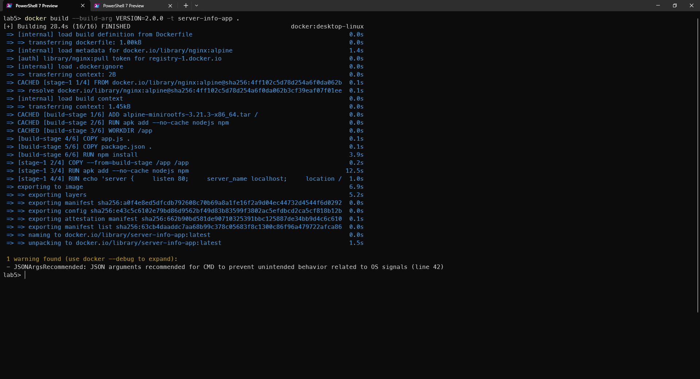
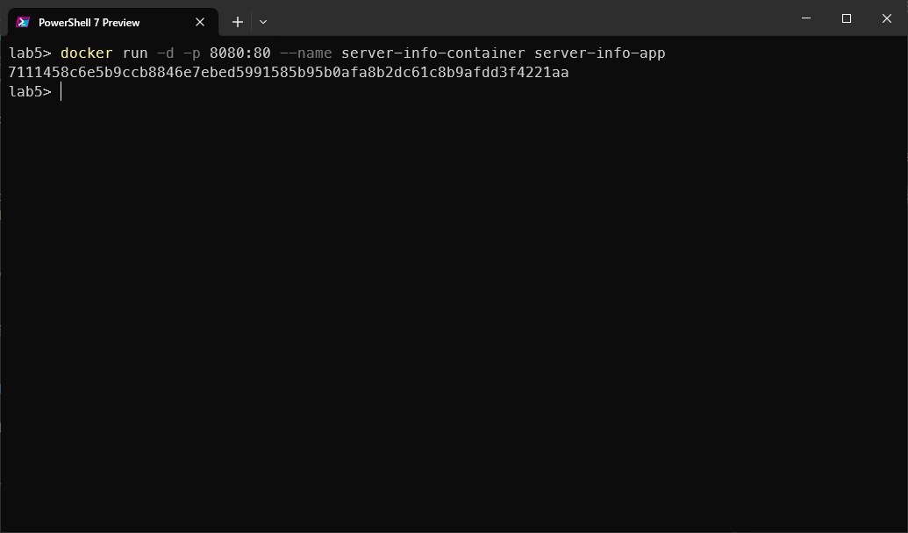
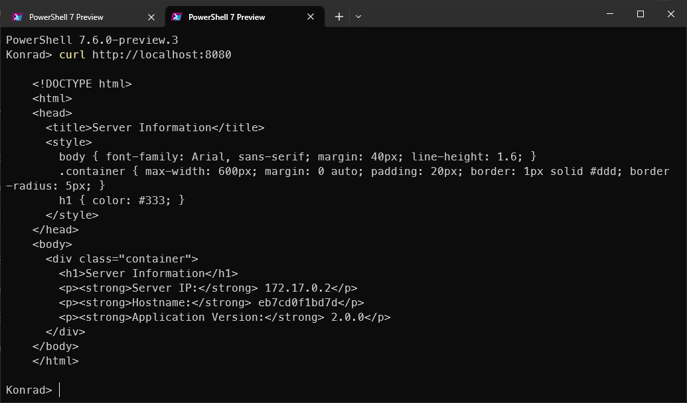
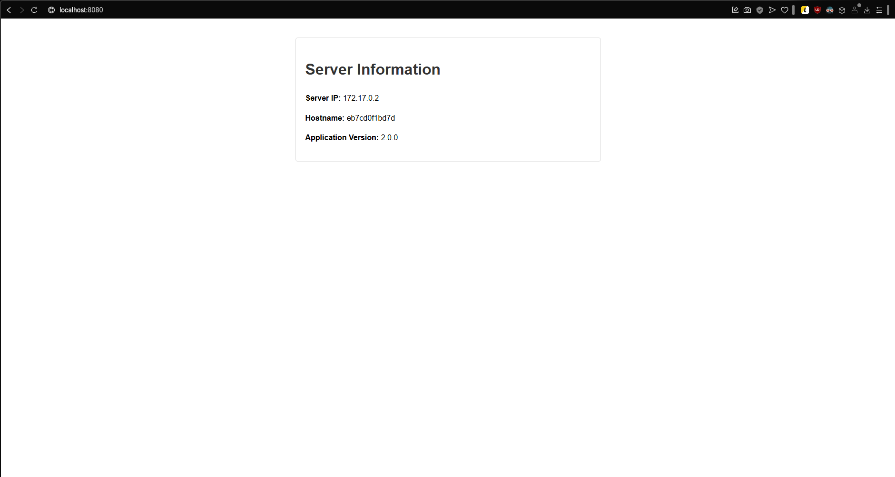

# Sprawozdanie z laboratorium 5 - Docker Multi-stage Build

## Treść pliku Dockerfile

```dockerfile
FROM scratch AS build-stage
ADD alpine-minirootfs-3.21.3-x86_64.tar /
RUN apk add --no-cache nodejs npm

ARG VERSION=1.0.0
ENV APP_VERSION=$VERSION

WORKDIR /app

COPY app.js .
COPY package.json .

RUN npm install

FROM nginx:alpine

COPY --from=build-stage /app /app

RUN apk add --no-cache nodejs npm

ARG VERSION=1.0.0
ENV APP_VERSION=$VERSION

RUN echo 'server { \
    listen 80; \
    server_name localhost; \
    location / { \
        proxy_pass http://localhost:3000; \
        proxy_http_version 1.1; \
        proxy_set_header Upgrade $http_upgrade; \
        proxy_set_header Connection "upgrade"; \
        proxy_set_header Host $host; \
        proxy_cache_bypass $http_upgrade; \
    } \
}' > /etc/nginx/conf.d/default.conf

HEALTHCHECK --interval=30s --timeout=3s CMD wget --no-verbose --tries=1 --spider http://localhost/ || exit 1

EXPOSE 80

CMD sh -c "cd /app && node app.js & nginx -g 'daemon off;'"
```

## Polecenie do budowy obrazu i wynik

Użyte polecenie:
```bash
docker build --build-arg VERSION=2.0.0 -t server-info-app .
```

Wynik działania polecenia:



## Polecenie uruchamiające serwer

Użyte polecenie:
```bash
docker run -d -p 8080:80 --name server-info-container server-info-app
```

Wynik działania polecenia:



## Potwierdzenie działania kontenera

Użyte polecenie curl do weryfikacji działania aplikacji:
```bash
curl http://localhost:8080
```

Wynik działania curl:



## Potwierdzenie poprawności funkcjonowania aplikacji

Zrzut ekranu z przeglądarki pokazujący działającą aplikację:



## Podsumowanie

Aplikacja została poprawnie zbudowana przy użyciu techniki multi-stage build w Docker. Aplikacja poprawnie wyświetla informacje o:
- Adresie IP serwera
- Nazwie serwera (hostname)
- Wersji aplikacji (2.0.0, określonej przy budowie obrazu)

Kontener działa poprawnie, co zostało potwierdzone zarówno poprzez zapytanie curl jak i wyświetlenie strony w przeglądarce.